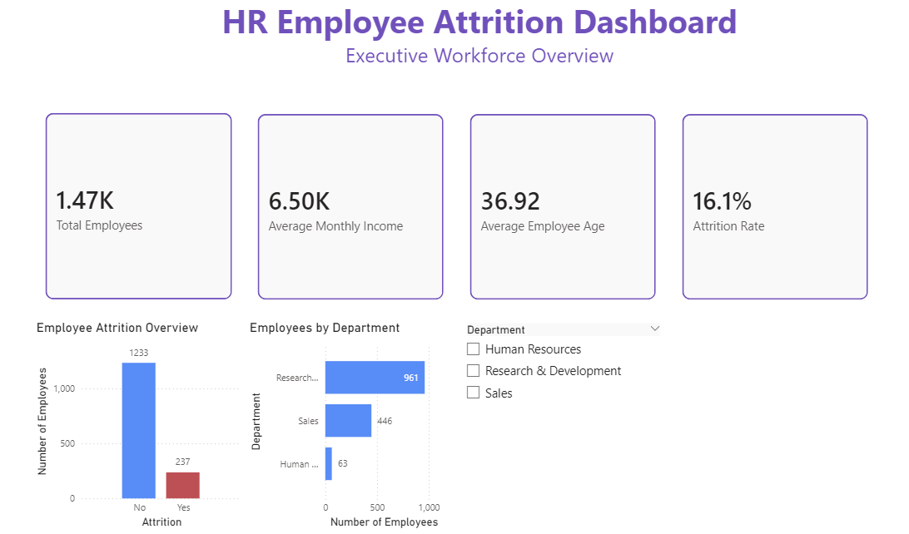
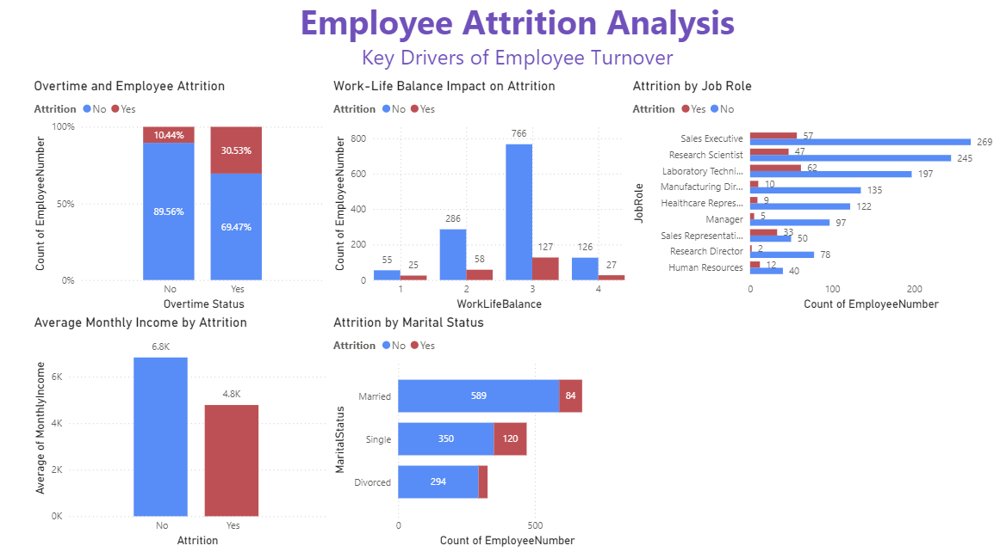
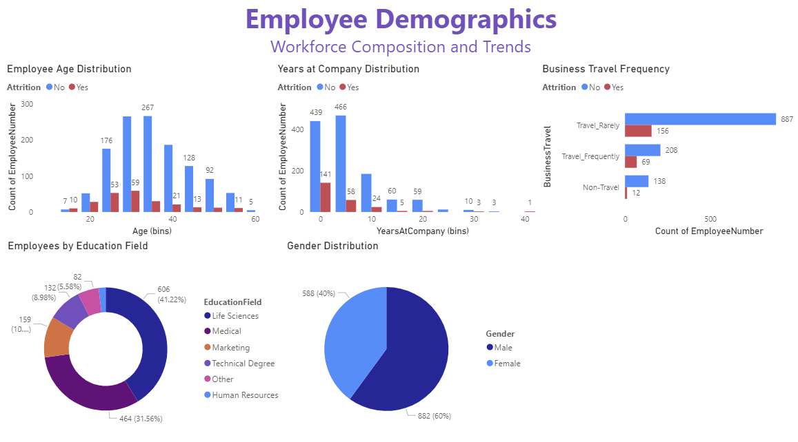

# HR Employee Attrition Analysis

## Project Overview

This project analyzes employee attrition trends using Python and Power BI to identify factors that may contribute to workforce turnover. The analysis explores employee demographics, overtime patterns, compensation, work-life balance, job roles, and other HR-related metrics to uncover key drivers of attrition.

The project combines exploratory data analysis in Python with interactive dashboard development in Power BI to create a business-focused workforce analytics report.

---

## Objectives

- Analyze employee attrition patterns
- Identify potential drivers of employee turnover
- Explore workforce demographics and compensation trends
- Build interactive dashboards for HR analytics and decision-making
- Practice business intelligence and data visualization workflows

---

## Tools & Technologies

### Python
- Pandas
- NumPy
- Matplotlib
- Seaborn
- Jupyter Notebook

### Business Intelligence
- Power BI

### Other Tools
- GitHub
- VS Code

---

## Dataset

Dataset used:
IBM HR Analytics Employee Attrition & Performance Dataset

Source:
https://www.kaggle.com/datasets/pavansubhasht/ibm-hr-analytics-attrition-dataset

---

## Key Business Questions

This project explores questions such as:

- Which factors are most associated with employee attrition?
- Does overtime increase turnover risk?
- How does monthly income relate to attrition?
- Which job roles experience the highest attrition?
- How do demographics and work-life balance affect retention?

---

## Key Findings

### Overtime and Attrition
Employees working overtime showed significantly higher attrition rates compared to employees who did not work overtime.

### Compensation Trends
Employees who left the company had lower average monthly incomes than retained employees.

### Work-Life Balance
Lower work-life balance ratings were associated with increased employee attrition.

### Job Role Insights
Certain job roles, including Sales Executive and Laboratory Technician, experienced higher attrition counts than other positions.

### Marital Status
Single employees showed higher attrition rates compared to married employees.

---

## Dashboard Pages

### Executive Workforce Overview
- Total employee count
- Attrition rate
- Average employee age
- Average monthly income
- Department distribution

### Attrition Analysis
- Overtime vs attrition
- Work-life balance analysis
- Attrition by job role
- Income comparison
- Marital status analysis

### Employee Demographics
- Age distribution
- Years at company distribution
- Business travel frequency
- Education field breakdown
- Gender distribution

---

## Dashboard Preview

### Executive Workforce Overview


### Attrition Analysis


### Employee Demographics


---

## Project Structure

```text
hr-employee-attrition-analysis/
│
├── data/
│   ├── employee_attrition.csv
│   └── clean_employee_attrition.csv
│
├── notebooks/
│   └── hr_attrition_analysis.ipynb
│
├── powerbi/
│   └── hr_attrition_dashboard.pbix
│
├── visuals/
│   ├── dashboard_page1.png
│   ├── dashboard_page2.png
│   └── dashboard_page3.png
│
├── README.md
└── requirements.txt
```

---

## How to Run the Project

1. Clone the repository
2. Install required Python libraries:

```bash
pip install -r requirements.txt
```

3. Run the Jupyter notebook inside the `notebooks` folder
4. Open the Power BI dashboard file located in the `powerbi` folder

---

## Skills Demonstrated

- Data cleaning and preprocessing
- Exploratory data analysis (EDA)
- Business intelligence dashboard development
- HR analytics
- Data visualization
- Insight generation and business storytelling
- Python data analysis workflows
- Power BI reporting

---

## Author

Gabby Coleman
